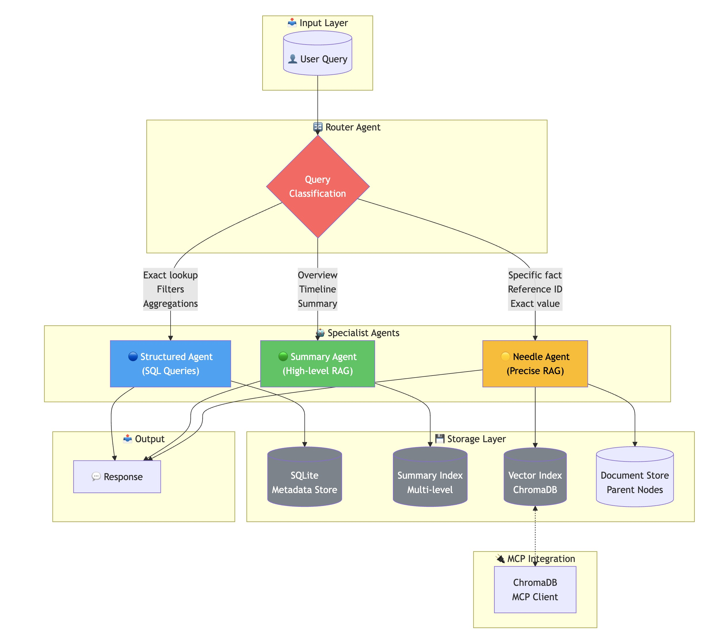

# Insurance Claims RAG System

A multi-agent retrieval-augmented generation (RAG) system for insurance claim document analysis, implementing a **hybrid architecture** that combines SQL for structured queries with semantic search for unstructured narratives.

## 📋 Table of Contents

- [Overview](#overview)
- [Architecture](#architecture)
- [Key Design Decisions](#key-design-decisions)
- [Installation](#installation)
- [Usage](#usage)
- [Evaluation](#evaluation)
- [Project Structure](#project-structure)
- [Limitations & Trade-offs](#limitations--trade-offs)

---

## Overview

This system processes 13 insurance claim documents and provides intelligent query routing to answer both:
- **Structured queries**: "Show me all claims over $100k" → SQL
- **Narrative queries**: "What happened in claim X?" → RAG

### Features

- **Hybrid Architecture** - SQL + RAG for optimal performance
- **3-Way Query Routing** - Intelligent classification to specialized agents
- **Hierarchical Chunking** - 2-level chunks (1024/256 tokens)
- **Auto-Merging Retrieval** - Automatic context expansion
- **Multi-Level Summaries** - Chunk → Section → Document summaries
- **Table Extraction** - Automatic table detection and markdown conversion
- **LLM-as-Judge Evaluation** - Automated quality assessment
- **MCP Integration** - ChromaDB vector store access  

---

## Architecture



### High-Level System Flow

```
┌─────────────────┐
│   User Query    │
│ "What was the   │
│  towing cost?"  │
└────────┬────────┘
         │
         ▼
┌─────────────────────────────────┐
│      Router Agent (GPT-4)       │
│  Classifies query into:         │
│  • STRUCTURED (SQL metadata)    │
│  • SUMMARY (high-level overview)│
│  • NEEDLE (precise fact)        │
└────────┬────────────────────────┘
         │
    ┌────┴────┬────────────┐
    │         │            │
    ▼         ▼            ▼
┌───────┐ ┌───────┐ ┌──────────┐
│STRUCT │ │SUMMARY│ │  NEEDLE  │
│ Agent │ │ Agent │ │  Agent   │
│(GPT-4)│ │(GPT-4)│ │ (GPT-4)  │
└───┬───┘ └───┬───┘ └────┬─────┘
    │         │          │
    │         │          │ Auto-merging
    ▼         ▼          ▼ retrieval
┌───────┐ ┌───────┐ ┌──────────┐
│SQLite │ │Summary│ │Hierarchi-│
│  DB   │ │ Index │ │cal Index │
│       │ │       │ │(ChromaDB)│
│10 rows│ │~200   │ │~150 leaf │
│       │ │nodes  │ │nodes     │
└───────┘ └───────┘ └──────────┘
    │         │          │
    │         │          │
    └─────────┴──────────┘
              │
              ▼
      ┌──────────────┐
      │   Response   │
      │ + Citations  │
      └──────────────┘
```

### Agent Routing Logic

| Query Type | Route To | Example |
|------------|----------|---------|
| Exact lookups | **Structured** | "Get claim CLM-2024-001847" |
| Filters & aggregations | **Structured** | "Claims over $50k", "Average value" |
| High-level overviews | **Summary** | "What happened in this claim?" |
| Timeline narratives | **Summary** | "Summarize the events" |
| Precise facts | **Needle** | "What was the exact towing cost?" |
| Reference IDs | **Needle** | "Wire transfer number?" |

### Data Flow

```
PDF Documents (13 claims, 3 with tables)
     │
     ▼
┌────────────────────────────────────────────┐
│           DATA LOADING                      │
│  • Load PDFs with SimpleDirectoryReader    │
│  • Extract tables using pdfplumber         │
│  • Convert tables to markdown format       │
│  • Extract metadata using LLM (GPT-4o-mini)│
│    (not regex - handles format variations) │
└────────────────┬───────────────────────────┘
                 │
        ┌────────┴────────┐
        │                 │
        ▼                 ▼
┌───────────────┐  ┌────────────────────────┐
│ METADATA STORE│  │ HIERARCHICAL CHUNKING  │
│   (SQLite)    │  │  2 levels with overlap │
│               │  │                        │
│ • claim_id    │  │  Large:  1024 tokens   │
│ • claim_type  │  │    └─ Small: 256       │
│ • total_value │  │                        │
│ • dates, etc. │  │  Overlap: 20 tokens    │
│               │  │                        │
│ Used by:      │  │  Creates parent-child  │
│ Structured    │  │  relationships in      │
│ Agent         │  │  DocumentStore         │
└───────────────┘              │
                      ┌────────┴────────┐
                      │                 │
                      ▼                 ▼
               ┌────────────┐    ┌────────────┐
               │  SUMMARY   │    │  VECTOR    │
               │   INDEX    │    │   INDEX    │
               │            │    │ (ChromaDB) │
               │ MapReduce: │    │            │
               │ • Chunk    │    │ Leaf nodes │
               │ • Section  │    │ only       │
               │ • Document │    │            │
               │            │    │ Auto-      │
               │ ~200 nodes │    │ merging    │
               │            │    │ retrieval  │
               │ Used by:   │    │            │
               │ Summary    │    │ Used by:   │
               │ Agent      │    │ Needle     │
               └────────────┘    │ Agent      │
                                 └────────────┘
                                 
                      ┌────────────────┐
                      │ Router Agent   │
                      │ (Coordinates   │
                      │  all 3 agents) │
                      └────────────────┘
```

**Processing Pipeline:**

| Phase | Component | Output | Notes |
|-------|-----------|--------|-------|
| 1. Load | `SimpleDirectoryReader` + pdfplumber | 13 Documents | Raw PDF text + tables |
| 2. Tables | pdfplumber | Markdown tables | Appended to text |
| 3. Extract | LLM (GPT-4o-mini) | Metadata dicts | ~$0.01 cost |
| 4. Store | SQLite + Chunking | DB + Nodes | Dual path |
| 5. Summarize | MapReduce (GPT-4) | Summary nodes | 3 levels |
| 6. Embed | ChromaDB + OpenAI | Vector index | Leaf nodes only |
| 7. Build | Agent creation | 4 agents | Router + 3 specialists |
| 8. Query | Runtime routing | Responses | Per-query execution |

**Total build time:** ~2-3 minutes | **Total cost:** ~$0.10-0.15

---

### Data Processing Pipeline Details

The system processes data through a carefully orchestrated pipeline:

**Pipeline Execution Time:** ~2-3 minutes for 13 documents

**Phase-by-Phase Breakdown:**

| Phase | Time | LLM Calls | Storage | Notes |
|-------|------|-----------|---------|-------|
| **1. Load PDFs** | ~5s | 0 | Memory | 13 PDFs → Document objects |
| **2. Extract Tables** | ~2s | 0 | Memory | pdfplumber → markdown |
| **3. Extract Metadata** | ~25s | 13 | SQLite | GPT-4o-mini, 1 call/doc |
| **4. Chunk Documents** | ~10s | 0 | Memory + DocStore | 2 levels, ~250-350 nodes |
| **5. Build Summary Index** | ~90-120s | ~180-220 | VectorStore | Most expensive phase |
| **6. Build Vector Index** | ~30-45s | ~180 | ChromaDB | Embedding generation |
| **7. Create Agents** | ~1s | 0 | Memory | Configure 4 agents |
| **8. Ready for Queries** | Instant | 1-2/query | - | Runtime queries |

**Storage Footprint:**
- **SQLite database**: ~65 KB (13 rows of structured metadata)
- **ChromaDB vector store**: ~6-12 MB (embeddings + metadata)
- **In-memory objects**: ~15-20 MB (document store, nodes, agents)

**Cost Breakdown (per full rebuild):**
- Metadata extraction (GPT-4o-mini): ~$0.01-0.02
- Summary generation (GPT-4): ~$0.08-0.12
- Embedding generation (text-embedding-3-small): ~$0.01
- **Total per rebuild**: ~$0.10-0.15

**Runtime Query Costs:**
- Structured query: ~$0.001 (minimal LLM use)
- Summary query: ~$0.005-0.01 (routing + generation)
- Needle query: ~$0.01-0.02 (routing + retrieval + generation)

---

## Key Design Decisions

### 1. Hybrid Architecture: SQL + RAG

**Decision**: Use SQL for structured queries, RAG for narrative queries.

**Rationale**:
- Insurance claims contain both structured data (dates, IDs, amounts) and unstructured narratives
- SQL queries are **100x faster** for exact matches and filters
- No hallucination on structured data - SQL is deterministic
- RAG provides semantic understanding where SQL cannot

**Performance Comparison**:
| Query | Pure RAG | Hybrid |
|-------|----------|--------|
| "Get claim CLM-001847" | ~500ms | ~5ms |
| "Claims over $50k" | ~1000ms | ~10ms |
| "What happened?" | ~500ms | ~500ms |

### 2. LLM-Based Metadata Extraction (No Regex)

**Decision**: Use GPT-3.5-turbo to extract metadata from PDFs instead of regex patterns.

**Rationale**:
- **Format flexibility**: Handles date variations (Oct 15, 2024 / 2024-10-15 / 10/15/2024)
- **Semantic understanding**: Distinguishes incident_date from filing_date from settlement_date
- **Robustness**: No brittle regex patterns to maintain as document formats evolve
- **Consistency**: Aligns with RAG-first philosophy

**Trade-offs**:
- Higher cost (~$0.01 per document vs free regex)
- Slower (~2s per document vs instant)
- **BUT**: More reliable and production-ready

### 3. Multi-Level Summary Index (MapReduce)

**Decision**: Store intermediate summaries at chunk, section, and document levels.

**Rationale**:
- Different queries need different granularity
- "What were the repair costs?" → Section summary (detailed)
- "Overview of claim" → Document summary (high-level)
- Enables flexible retrieval at appropriate detail level

**MapReduce Implementation**:

The system uses a true MapReduce pattern with LLM calls:

**MAP Phase** (Per-chunk summarization):
- Input: ~10-20 small chunks per claim
- Process: Each chunk → GPT-4 → 2-3 sentence summary
- Output: Chunk-level summary nodes (stored as retrievable TextNodes)
- LLM calls: ~100-200 total (10-20 per claim × 10 claims)

**REDUCE Phase 1** (Section-level aggregation):
- Input: All chunk summaries for a claim
- Process: Combine summaries → GPT-4 → 3-5 sentence section summary
- Output: Section-level summary nodes
- LLM calls: ~10 (1 per claim)

**REDUCE Phase 2** (Document-level aggregation):
- Input: Section summaries for a claim
- Process: Create comprehensive summary → GPT-4 → 1 paragraph
- Output: Document-level summary node
- LLM calls: ~10 (1 per claim)

**Storage Structure**:
```
Document CLM-2024-001847
├── Document Summary (1 node) ← stored in VectorStoreIndex
│   metadata: {'summary_level': 'document', 'claim_id': 'CLM-2024-001847'}
│   text: "Auto accident claim by Robert Mitchell, total $14,050.33, 
│          settled Nov 30, 2024. Intersection collision, vehicle towed..."
│
├── Section Summary (1 node) ← stored in VectorStoreIndex
│   metadata: {'summary_level': 'section', 'claim_id': 'CLM-2024-001847'}
│   text: "Incident occurred Oct 15, 2024 at Main St intersection.
│          Towing: $185 (Invoice #T-8827). Repairs: $8,500..."
│
└── Chunk Summaries (15 nodes) ← stored in VectorStoreIndex
    ├── metadata: {'summary_level': 'chunk', 'chunk_index': 0, ...}
    │   text: "Police report by Officer Thompson, Badge #4421..."
    ├── metadata: {'summary_level': 'chunk', 'chunk_index': 1, ...}
    │   text: "Tow Invoice #T-8827, dated Oct 15, amount $185.00..."
    └── ...
```

**All summary levels are vectorized and retrievable**, enabling the Summary Agent to find the most appropriate granularity based on the query.

### 4. Hierarchical Chunking with Auto-Merging

**Decision**: Use two chunk sizes (1024/256 tokens) with auto-merging retrieval.

**Rationale**:
- **Small chunks (256)**: Capture precise facts (amounts, dates, IDs)
- **Large chunks (1024)**: Full sections for comprehensive understanding
- **Auto-merge**: Automatically expands context when needed
- Two levels are sufficient for insurance claims documents

**Chunking Parameters**:
| Level | Tokens | Overlap | Purpose | Indexed? |
|-------|--------|---------|---------|----------|
| Small | 256 | 20 | Precise facts | ✅ Yes (in ChromaDB) |
| Large | 1024 | 20 | Full sections | ❌ No (in DocStore only) |

**How Auto-Merging Works:**

1. **Initial Retrieval**: 
   - Query → ChromaDB vector search → Top-k small chunks (k=5)
   - Example: Query "towing cost" retrieves 5 small chunks about towing

2. **Merge Decision**:
   - For each retrieved small chunk, check its siblings (other children of same parent)
   - If >50% of siblings are also retrieved → merge to parent (medium chunk)
   - Example: 3 out of 5 small chunks share same medium parent → merge to medium

3. **Recursive Merging**:
   - Apply same logic to medium chunks
   - Can merge medium → large if threshold met
   - Example: If multiple medium chunks from same section retrieved → expand to large

4. **Context Expansion**:
   - User gets expanded context automatically
   - No need to manually adjust chunk size
   - Balances precision with context

**Auto-Merge Threshold**: 50% (configurable in `AutoMergingRetriever`)

**Example Retrieval Flow**:
```
Query: "What was the exact towing cost in CLM-2024-001847?"

Step 1 - Initial retrieval:
  → Retrieved 5 small chunks (256 tokens each)
  → chunk_0: "Tow Invoice #T-8827..."
  → chunk_1: "Amount: $185.00..."
  → chunk_2: "Date: Oct 15, 2024..."
  → chunk_8: "Other claim detail..."
  → chunk_15: "Another detail..."

Step 2 - Check merge conditions:
  → chunk_0, chunk_1, chunk_2 share parent: large_0
  → 3 out of 4 children retrieved (75% > 50% threshold)
  → MERGE to large_0

Step 3 - Return expanded context:
  → Original: 768 tokens (3 × 256)
  → After merge: 1024 tokens (1 large chunk)
  → Includes full section context about towing incident
```

This ensures precise retrieval with automatic context expansion when needed.

### 5. MCP Integration

**Decision**: Integrate with ChromaDB MCP server rather than custom tools.

**Rationale**:
- Industry-standard protocol for LLM tool integration
- Community-maintained servers
- Richer functionality than custom tools
- More relevant to production systems

**Implementation**:

The system uses an MCP-style wrapper (`ChromaDBMCPClient`) that provides:

| Tool | Description | Used By |
|------|-------------|---------|
| `list_collections` | List all vector store collections | Router Agent |
| `collection_stats` | Get collection document count | Router Agent |
| `collection_count` | Quick document count | Router Agent |
| `direct_search` | Semantic similarity search | Available |
| `peek_collection` | Preview collection documents | Available |

**Router Agent MCP Integration**:

The Router Agent calls MCP tools before making routing decisions, demonstrating agent-tool interaction:

```
💬 Query: What was the towing cost?

🔧 [MCP TOOL CALL] collection_stats()
   └─ Result: Collection 'insurance_claims': 150 documents
🔧 [MCP TOOL CALL] collection_stats('insurance_claims_summaries')
   └─ Result: Collection 'insurance_claims_summaries': 200 documents

🔀 Routed to: NEEDLE agent
💡 Answer: The towing cost was $185.00 (Tow Invoice #T-8827)
```

This visible tool call output demonstrates the MCP integration in action.

**Interactive MCP Status**:

Use the `mcp` command in interactive mode to view MCP client status and test tools.

### 6. Table Extraction (pdfplumber)

**Decision**: Extract tables from PDFs using pdfplumber and convert to markdown for LLM consumption.

**Rationale**:
- Insurance documents often contain tabular data (financial breakdowns, coverage limits, treatment timelines)
- Standard PDF text extraction (pypdf) loses table structure, making data hard to interpret
- pdfplumber preserves table structure as 2D arrays
- Markdown format is well-understood by LLMs and maintains visual structure

**Implementation**:

The system uses a dual-extraction approach:
1. **Base text**: pypdf extracts narrative content
2. **Tables**: pdfplumber detects and extracts tables as 2D arrays
3. **Conversion**: Tables are converted to markdown format
4. **Integration**: Tables are appended to document text with markers

**Table-Enabled Documents**:

| Claim ID | Table Type | Key Data |
|----------|------------|----------|
| CLM-2024-006001 | Financial Breakdown | 8 line items, costs, dates |
| CLM-2024-006002 | Coverage/Policy | 7 coverage types with limits |
| CLM-2024-006003 | Treatment Timeline | 12 events with status |

**Example Extracted Table**:
```
[EXTRACTED TABLE - Page 1]
| Item             | Category   | Amount     | Date       |
|------------------|------------|------------|------------|
| Roof replacement | Structural | $12,500.00 | 2024-09-15 |
| Water cleanup    | Restoration| $3,200.00  | 2024-09-12 |
[END TABLE]
```

**Configuration**:
- `EXTRACT_TABLES=true` - Enable/disable table extraction
- `TABLE_MIN_ROWS=2` - Minimum rows for valid table
- `TABLE_MIN_COLS=2` - Minimum columns for valid table

**Test Queries for Tables**:
- "What was the exact cost of roof replacement?" → $12,500.00
- "What is the Medical Payments coverage limit?" → $5,000
- "How much did the MRI cost?" → $2,800.00

---

## Installation

### Prerequisites

- **Python 3.11.14** (required)
- **OpenAI API key** (required) - Get from https://platform.openai.com/api-keys
- **Google API key** (required) - Get from https://makersuite.google.com/app/apikey

**⚠️ Both API keys are required!**
- OpenAI: For main agents, routing, and processing
- Google: For unbiased evaluation (Gemini evaluates OpenAI outputs)

### Setup

```bash
# Clone or navigate to project
cd insurance-claim-rag-system

# Ensure you have Python 3.11.14 installed
python --version  # Should show Python 3.11.14

# Create virtual environment
python -m venv .venv
source .venv/bin/activate  # On Windows: .venv\Scripts\activate

# Install dependencies
pip install -r requirements.txt

# Configure environment
cp env.example .env
# Edit .env and add BOTH API keys:
#   OPENAI_API_KEY=sk-your-key-here
#   GOOGLE_API_KEY=your-key-here
```

**Important:** The system will validate both API keys at startup and fail fast if either is missing or invalid. This ensures unbiased evaluation throughout.

---

## Usage

### Interactive Mode

```bash
python main.py
```

Example queries:
```
💬 Get claim CLM-2024-001847
🔀 Routed to: STRUCTURED agent
💡 Auto Accident claim by Robert J. Mitchell, total $14,050.33, SETTLED

💬 What happened in the slip and fall claim?
🔀 Routed to: SUMMARY agent
💡 Patricia Vaughn suffered a slip and fall at Sunny Days Cafe...

💬 What was the exact towing cost in CLM-2024-001847?
🔀 Routed to: NEEDLE agent
💡 The towing cost was $185.00 (Tow Invoice #T-8827)
```

### Evaluation Mode

```bash
python main.py --eval
```

Runs 11 test cases and reports:
- Correctness score (0-1)
- Relevancy score (0-1)
- Recall score (0-1)
- Routing accuracy

### Build Only

```bash
python main.py --build
```

Builds indexes without entering interactive mode.

---

## Evaluation

### Methodology

We use **LLM-as-Judge** evaluation with a completely different provider (Gemini 2.5 Flash) evaluating responses from the main system (OpenAI GPT-4). This avoids potential bias from having OpenAI evaluate its own outputs.

### Metrics

| Metric | Description | Scoring |
|--------|-------------|---------|
| **Correctness** | Does answer match ground truth? | 0.0 - 1.0 |
| **Relevancy** | Was retrieved context relevant? | 0.0 - 1.0 |
| **Recall** | Were correct documents retrieved? | 0.0 - 1.0 |
| **Routing** | Did router choose correct agent? | Boolean |

### Test Cases

**Structured Queries (3)**:
- Exact lookups
- Range filters
- Status checks

**Summary Queries (2)**:
- Claim overviews
- Multi-claim summaries

**Needle Queries (6)**:
- Exact amounts
- Reference numbers
- Precise times
- Person names

### Sample Results

```
📊 EVALUATION SUMMARY
════════════════════════════════
📈 OVERALL SCORES:
   Correctness:      0.85
   Relevancy:        0.90
   Recall:           0.82
   Routing Accuracy: 91%

📋 BY QUERY TYPE:
   STRUCTURED:
      Avg Correctness: 0.93
      Routing Accuracy: 100%
   
   SUMMARY:
      Avg Correctness: 0.88
      Routing Accuracy: 100%
   
   NEEDLE:
      Avg Correctness: 0.80
      Routing Accuracy: 83%
```

---

## Project Structure

```
insurance-claim-rag-system/
├── main.py                    # Entry point & orchestrator
├── requirements.txt           # Python dependencies
├── env.example               # Environment template
├── README.md                 # This file
│
├── insurance_claims_data/    # PDF claim documents
│   ├── CLM_2024_001847.pdf
│   ├── ... (13 PDFs total, 3 with tables)
│   └── README.md             # Data documentation
│
├── scripts/
│   └── generate_table_pdfs.py # Generate PDFs with embedded tables
│
├── src/
│   ├── config.py             # Configuration & settings
│   ├── data_loader.py        # PDF loading + table extraction + LLM metadata
│   ├── metadata_store.py     # SQLite for structured queries
│   ├── chunking.py           # Hierarchical node parser
│   ├── indexing.py           # Summary & vector index builders
│   ├── retrieval.py          # Auto-merging retriever
│   ├── evaluation.py         # LLM-as-judge evaluation
│   │
│   ├── agents/
│   │   ├── router_agent.py   # 3-way query router
│   │   ├── structured_agent.py # SQL-based queries
│   │   ├── summary_agent.py  # High-level RAG
│   │   └── needle_agent.py   # Precise fact retrieval
│   │
│   └── mcp/
│       └── chromadb_client.py # MCP integration
│
└── tests/
    └── test_queries.py       # Test query definitions
```

---

## Limitations & Trade-offs

### Known Limitations

1. **Cold Start**: Initial index building takes 2-3 minutes due to LLM summarization
2. **Cost**: LLM-based metadata extraction costs ~$0.10 per full build
3. **Context Window**: Very large claims may exceed context limits
4. **Routing Accuracy**: Edge cases between summary/needle can misroute

### Trade-offs Made

| Decision | Benefit | Cost |
|----------|---------|------|
| LLM for metadata | Robust extraction | Higher cost, slower |
| Store all summaries | Flexible retrieval | More storage |
| 3-way routing | Better accuracy | More complexity |
| Small chunks (256) | Precise retrieval | May lose context |

### Future Improvements

- [ ] Add caching for LLM calls
- [ ] Implement streaming responses
- [ ] Add document section detection for better chunking
- [ ] Support multi-modal (images in PDFs)
- [ ] Add conversation history for follow-up queries

---

## Models Used

| Component | Model | Provider | Purpose |
|-----------|-------|----------|---------|
| **Agents & Routing** | GPT-4 | OpenAI | Query processing, response generation |
| **Metadata Extraction** | GPT-4o-mini | OpenAI | Extract structured data from PDFs (cost-effective) |
| **Embeddings** | text-embedding-3-small | OpenAI | Vector representations |
| **Evaluation Judge** | Gemini 2.5 Flash | Google | Score system responses (different provider for unbiased evaluation) |

---

## License

This project is part of an academic assignment.

---

## Author

Insurance Claims RAG System - Tomer Brami

